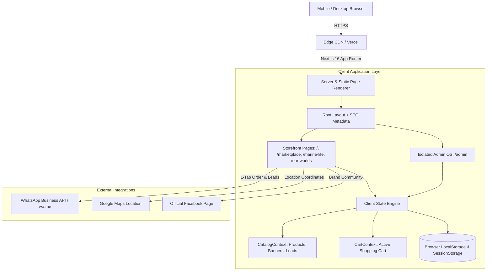

# SOFTWARE REQUIREMENTS SPECIFICATION & DESIGN DOCUMENT (SRD / SRS)

**Project Title:** Marine Creatures — Luxury Marine Life E-Commerce & Architectural Aquascaping Platform  
**Document Reference:** `CODEVERSE/SRD/2026/MC-01`  
**Version:** 1.0 (Production Release)  
**Date:** September 08, 2026  
**Author:** Aritya Saha (CODEVERSE Technologies)  
**Client:** Marine Creatures (Suraj Shasmal)  
**Status:** Approved for Market Deployment  

---

## 1. INTRODUCTION

### 1.1 Purpose
This Software Requirements and Design (SRD) document provides a comprehensive technical, functional, and architectural specification for the **Marine Creatures** platform. It defines system requirements, user personas, system workflows, database models, security posture, and non-functional requirements.

### 1.2 Business Context & Objectives
Marine Creatures is an architectural marine aquarium design firm and exotic saltwater specimen supplier based in Kolkata, India. The primary business objectives are:
1. **Brand Authority:** Establish a luxury digital footprint rivaling top international marine brands.
2. **Direct-to-Consumer Commerce:** Offer an interactive, categorized catalog of rare saltwater livestock and specialized reef hardware.
3. **High-Ticket Consultation Acquisition:** Capture leads for bespoke luxury residential and corporate aquarium builds.
4. **Mobile-First Accessibility:** Optimize experiences for 90%+ smartphone visitors who order and communicate primarily via WhatsApp.
5. **Lean Operational Overhead:** Eliminate costly third-party database subscriptions during the pre-onboarding phase using local state and secure JSON snapshots.

---

## 2. USER PERSONAS & STAKEHOLDERS

| Persona | Role | Primary Goal | Key Workflows |
| :--- | :--- | :--- | :--- |
| **P-1: Retail Reef Hobbyist** | Customer (Mobile-first) | Browse rare marine fish/corals, check care levels, and purchase livestock safely. | Search catalog, filter by category, view live arrival guarantee, click "Order on WhatsApp". |
| **P-2: High-Net-Worth Client / Architect** | Enterprise Customer | Commission custom architectural aquariums for luxury homes, hotels, and offices. | Explore case studies in `/our-worlds`, read material specs, submit consultation inquiries. |
| **P-3: Business Owner / Store Manager** | Admin (`/admin`) | Manage stock counts, adjust prices, broadcast sales banners, and reply to client inquiries. | Authenticate with master passcode, tap +/- stock counters, toggle item availability, 1-tap WhatsApp reply. |

---

## 3. FUNCTIONAL REQUIREMENTS (FR)

### 3.1 Module 1: Storefront & Brand Experience
- **FR-1.1 (Hero Experience):** System shall render an ambient luxury viewport with dynamic particle drifter animations, value proposition, and direct calls to action.
- **FR-1.2 (Promotional Announcement Carousel):** System shall display an auto-sliding or user-controlled promotional carousel showcasing new drops, live stock announcements, and seasonal discounts.
- **FR-1.3 (Architectural Portfolio):** System shall display high-resolution imagery and specs for flagship aquarium projects (`/our-worlds`), including dimensional footprints, filtration specs, and biome types.
- **FR-1.4 (Educational Species Dossiers):** System shall provide dedicated detail views for delicate specimens (`/marine-life/[slug]`) specifying reef compatibility, diet, water parameters, and care level.

### 3.2 Module 2: E-Commerce Marketplace (`/marketplace`)
- **FR-2.1 (Categorized Browsing):** System must categorize inventory into five primary segments:
  - Marine Life (Livestock & Corals)
  - Lighting & Tech (NemoLight, LED modules)
  - Live Rock & Sand (Biological media)
  - Salts & Chemistry (Nutrient additives, synthetic sea salt)
  - Hardware (Protein skimmers, titanium heaters, pumps)
- **FR-2.2 (Instant Search & Filtering):** Real-time client-side substring matching on common names, scientific names, and categories without page reload.
- **FR-2.3 (Stock Indicators):** System must display real-time stock levels, showing `In Stock`, `Low Stock (<=3)`, or `Out of Stock`. Out-of-stock items disable cart additions.
- **FR-2.4 (WhatsApp Checkout Integration):** Cart and product detail pages must generate pre-formatted WhatsApp URLs encoding product IDs, names, quantities, and client delivery inquiries to `+91 93304 36603`.

### 3.3 Module 3: Consultation & Lead Capture (`/contact`, `/aquarium-design`)
- **FR-3.1 (Multi-Step Inquiry Form):** Capture client name, phone number, email, desired space type (Penthouse, Villa, Corporate Office), and project notes.
- **FR-3.2 (Instant Lead Dispatch):** Form submission must store the lead directly into `CatalogContext` inquiries state and trigger confirmation feedback to the user.

### 3.4 Module 4: Mobile-First Admin Control Center (`/admin`)
- **FR-4.1 (Access Protection):** Route must remain completely inaccessible without entering the secret passcode (`NEXT_PUBLIC_ADMIN_PASSCODE` / `mc@admin#2026!`). Session state must persist in encrypted `sessionStorage`.
- **FR-4.2 (Customer Isolation):** All navigation links, footer shortcuts, and mobile bottom bars targeting `/admin` must be omitted from customer-facing views.
- **FR-4.3 (Touch-Friendly Stock Management):** Admin UI must offer thumb-friendly `+` and `–` buttons to modify unit counts and single-tap status toggles (`● Active` vs. `○ Paused`).
- **FR-4.4 (Live Banner Management):** Store manager must have full CRUD capabilities to publish, hide, or delete promotional announcement slides.
- **FR-4.5 (One-Tap WhatsApp Client Lead Follow-Up):** Leads dashboard must generate pre-populated WhatsApp follow-up URLs with the customer's name and consultation topic.
- **FR-4.6 (Backup & Restore Engine):** Enable one-click export of catalog and leads to a timestamped `.json` file, and provide a restore field to import data on any browser.

---

## 4. DATA MODEL & SCHEMA SPECIFICATIONS

The system uses a unified, strongly typed TypeScript domain model.

### 4.1 Product Entity
```typescript
interface Product {
  id: string;                    // Unique slug, e.g. "picasso-clownfish-pair"
  name: string;                  // Display title
  scientificName?: string;       // Latin binomial nomenclature
  brand?: string;                // Manufacturer or Marine Creatures direct
  category: 'marine-life' | 'lighting-tech' | 'rock-sand' | 'salt-chemistry' | 'hardware';
  categoryLabel: string;         // Human-readable category label
  price: number;                 // Active retail price in INR (₹)
  originalPrice?: number;        // MRP / strikethrough price in INR
  rating: number;                // 1.0 - 5.0 score
  reviewsCount: number;          // Total customer feedback count
  badge?: string;                // e.g. "Rare Pair", "Exclusive Drop"
  inStock: boolean;              // Storefront ordering toggle
  stockCount: number;            // Physical units available
  images: string[];              // High-resolution image URLs
  shortDesc: string;             // 1-line summary for cards
  description: string;           // Comprehensive product overview
  deliveryInfo: {
    estimatedDays: string;       // e.g. "Next-Day Express Dispatch"
    shippingMethod: string;      // e.g. "Oxygenated Insulated Thermal Pod"
    guaranteeText: string;       // e.g. "100% Live Arrival Guaranteed"
  };
  specifications: Record<string, string>; // Origin, Temperament, Care Level, etc.
}
```

### 4.2 BannerSlide Entity
```typescript
interface BannerSlide {
  id: string;                    // Unique slide identifier
  badge: string;                 // Promotional tag, e.g. "NEW ARRIVAL"
  badgeColor: string;            // Hex or CSS token, e.g. "#00B8D9"
  title: string;                 // Main headline
  subtitle: string;              // Supporting copy
  desc?: string;                 // Extended details
  image: string;                 // High-impact background visual
  ctaText: string;               // Button label, e.g. "EXPLORE NOW →"
  ctaLink: string;               // Target internal or external route
  secondaryCtaText?: string;     // Optional secondary action
  secondaryCtaLink?: string;     // Secondary action destination
  isActive: boolean;             // Carousel visibility switch
  priority: number;              // Slide order index
}
```

### 4.3 InquiryLead Entity
```typescript
interface InquiryLead {
  id: string;                    // Unique lead tracking identifier
  name: string;                  // Client full name
  phone: string;                 // Contact telephone / WhatsApp number
  email?: string;                // Email address
  type: 'consultation' | 'callback' | 'service';
  serviceType?: string;          // e.g. "Custom Reef Installation"
  spaceType?: string;            // e.g. "Penthouse", "Corporate Office"
  notes?: string;                // Client requirements / specifications
  createdAt: string;             // ISO-8601 timestamp
  status: 'new' | 'contacted' | 'closed';
}
```

---

## 5. SYSTEM ARCHITECTURE & TECH STACK



### 5.1 Technology Selection Justification
- **Next.js 16 (App Router) + Turbopack:** Extreme compilation speed, automatic code-splitting, static generation for zero-latency page delivery.
- **Tailwind CSS:** Fine-tuned tokenized design system (`--color-primary`, `--color-accent`, `--font-display`) producing tiny CSS bundles.
- **LocalStorage & SessionStorage Architecture:** Ensures zero database maintenance costs, zero latency, and 100% operational uptime while client establishes market traction.
- **WhatsApp Direct Connect:** Eliminates checkout friction in the Indian market; allows the store owner to negotiate live livestock shipping directly.

---

## 6. NON-FUNCTIONAL REQUIREMENTS (NFR)

### 6.1 Performance & Speed
- **First Contentful Paint (FCP):** Under 0.8 seconds on 4G mobile connections.
- **Total Blocking Time (TBT):** Under 150ms.
- **Lighthouse Performance Score:** 90+ across Mobile and Desktop.

### 6.2 Mobile Ergonomics & Accessibility
- Touch targets must adhere to WCAG 2.1 AA standards (minimum 44x44px for interactive items).
- Fixed bottom navigation bars must include safe-area insets (`env(safe-area-inset-bottom)`) for edge-to-edge iOS displays.
- Reduced motion fallback: Animations automatically simplify for users with `prefers-reduced-motion: reduce`.

### 6.3 Security & Integrity
- **Passcode Protection:** Admin dashboard is protected by client-side session hashing and environment variable overriding.
- **XSS Prevention:** React JSX prevents string injection; external URLs are strictly validated with `rel="noopener noreferrer"`.
- **Data Preservation:** Full offline export functionality prevents loss of client edits or catalog changes.

---

## 7. VERIFICATION, TESTING & ACCEPTANCE MATRIX

| Test ID | Test Scenario | Expected Result | Pass/Fail Criteria |
| :---: | :--- | :--- | :---: |
| **TC-01** | Admin Authentication | Entering `mc@admin#2026!` unlocks dashboard; wrong password triggers warning. | Strict Equality |
| **TC-02** | Customer Link Isolation | Customer inspecting header, footer, or mobile menu sees zero `/admin` traces. | Zero Links Present |
| **TC-03** | Live Stock Counter | Tapping `+` or `-` in admin updates available stock immediately without page refresh. | State Mutation Verified |
| **TC-04** | Out-of-Stock Handling | Setting stock to 0 shows "Out of Stock" badge on marketplace and disables checkout. | UI Badge & Disable Action |
| **TC-05** | WhatsApp Order Dispatch | Clicking order button opens WhatsApp with pre-filled item name and delivery query. | Encoded URI Match |
| **TC-06** | Catalog Backup & Restore | Exporting JSON, deleting an item, and importing restores the deleted item perfectly. | Data Integrity Verified |

---

## 8. APPROVAL & SIGN-OFF

This Software Requirements and Design Document serves as the official technical baseline for the platform deployment.

**Architect & Technical Lead:**  
**Aritya Saha** (Founder, CODEVERSE Technologies)  
*Date:* September 08, 2026  

**Client & Business Owner:**  
**Suraj Shasmal** (Founder, Marine Creatures)  
*Date:* September 08, 2026  
