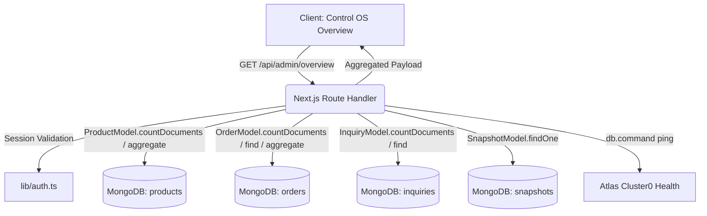

# Phase 3A: Marine Creatures Control OS Implementation Report
**Document Ref:** `docs/PHASE_3A_CONTROL_OS_IMPLEMENTATION_REPORT.md`  
**Milestone:** Phase 3A — Control OS Foundation & Admin Overview Dashboard  
**Status:** ACCEPTED  
**Date:** October 1, 2026  
**Engineering Discipline:** Staff Engineer / Product Architect / Security Engineer  

---

> [!IMPORTANT]
> **Explicit Scope Boundary:**  
> This phase implements **ONLY** the Control OS foundation and Overview Dashboard.  
> It does **NOT** implement the rest of Phase 3 (Catalog CMS, Worlds CMS, Operations/Quarantine, CRM Concierge, Editorial Content, Analytics BI, or Fleet Telemetry). All other modules are reserved in the information architecture and display transparent, non-functional phase dependency notices with zero fabricated data.

---

## 1. Existing Architecture Inspected

Before writing any new code, a full architectural audit was conducted across the codebase:

- **Routing & Presentation:** Inspected `app/admin/page.tsx`, `components/admin/AdminSidebar.tsx`, `components/admin/AdminHeader.tsx`, and existing tab components (`ProductsTab.tsx`, `OrdersTab.tsx`, `BannersTab.tsx`, `InquiriesTab.tsx`, `OverviewTab.tsx`, `SystemTab.tsx`).
- **Admin APIs:** Inspected `app/api/admin/login/route.ts`, `app/api/admin/logout/route.ts`, `app/api/admin/backup/route.ts`, `app/api/admin/upload/route.ts`, and `app/api/health/route.ts`.
- **Authentication & Security:** Inspected `lib/auth.ts`, examining the HMAC-SHA256 signature algorithm, timing-safe equality comparison (`timingSafeEqual`), session lifetime (8 hours), and `SESSION_COOKIE` (`mc_admin_session`).
- **Database Layer:** Inspected `lib/db.ts` (cached Mongoose connection pool against MongoDB Atlas `Cluster0`), verifying connection caching and graceful reconnections.
- **Data Models:** Inspected authoritative MongoDB models:
  - `Product` (`lib/models/Product.ts`): Verified 50 active products (`isArchived: { $ne: true }`), 10 archived items, 60 total catalog records.
  - `Order` (`lib/models/Order.ts`): Verified 10 records across lifecycle states (`placed`, `quarantine`, `packed`, `dispatched`, `delivered`).
  - `Inquiry` (`lib/models/Inquiry.ts`): Verified 3 client consultation leads with status tracking (`new`, `replied`, `closed`).
  - `Banner` (`lib/models/Banner.ts`): Verified 4 announcement slides.
  - `Snapshot` (`lib/models/Snapshot.ts`): Inspected cloud backup schema.
- **Contexts & Public Commerce:** Audited `CatalogContext.tsx`, `OrderContext.tsx`, WhatsApp dispatch triggers, cart state, and product SEO generators (`generateMetadata`, JSON-LD dossiers) to ensure zero regression.

---

## 2. Files Changed & Added

### A. New Architecture Files Created
1. [`app/admin/layout.tsx`](file:///c:/Users/User/OneDrive/Desktop/Marine%20Creatures/marine-creatures/app/admin/layout.tsx): Server-level layout providing strict SEO quarantine (`noindex, nofollow, noimageindex`) for all `/admin` routes.
2. [`app/api/admin/overview/route.ts`](file:///c:/Users/User/OneDrive/Desktop/Marine%20Creatures/marine-creatures/app/api/admin/overview/route.ts): Private, authenticated server-side aggregation endpoint delivering real-time metrics, Action Center tasks, and system health.
3. [`components/admin/ControlOsOverview.tsx`](file:///c:/Users/User/OneDrive/Desktop/Marine%20Creatures/marine-creatures/components/admin/ControlOsOverview.tsx): High-density, Bloomberg/Linear-style operational dashboard component.
4. [`components/admin/ControlOsPlaceholder.tsx`](file:///c:/Users/User/OneDrive/Desktop/Marine%20Creatures/marine-creatures/components/admin/ControlOsPlaceholder.tsx): Phase-aware operational placeholder component for non-implemented sections with roadmap dependencies and zero mock tables.

### B. Core Architecture Files Modified
1. [`components/admin/types.ts`](file:///c:/Users/User/OneDrive/Desktop/Marine%20Creatures/marine-creatures/components/admin/types.ts): Defined `ControlOsSection` (8 sections: `overview`, `catalog`, `worlds`, `operations`, `crm`, `content`, `analytics`, `system`) and the comprehensive `OverviewDashboardData` interface.
2. [`components/admin/AdminSidebar.tsx`](file:///c:/Users/User/OneDrive/Desktop/Marine%20Creatures/marine-creatures/components/admin/AdminSidebar.tsx): Updated to support the 8 Control OS modules with phase tags (`Active`, `Phase 3B`–`Phase 3F`), keyboard navigation, and accessible 44px touch targets.
3. [`components/admin/AdminHeader.tsx`](file:///c:/Users/User/OneDrive/Desktop/Marine%20Creatures/marine-creatures/components/admin/AdminHeader.tsx): Rebuilt with Control OS branding, secondary operational descriptors, live Indian Standard Time date display, authenticated identity, and mobile drawer controls.
4. [`app/admin/page.tsx`](file:///c:/Users/User/OneDrive/Desktop/Marine%20Creatures/marine-creatures/app/admin/page.tsx): Re-architected to be session-first. Removed client-side `sessionStorage` credential persistence; verified authentication purely via `/api/admin/overview` with `credentials: 'include'`. Mounted `ControlOsOverview` and `ControlOsPlaceholder`.
5. [`components/admin/modals/ProductFormModal.tsx`](file:///c:/Users/User/OneDrive/Desktop/Marine%20Creatures/marine-creatures/components/admin/modals/ProductFormModal.tsx): Deprecated client-side `x-admin-passcode` forwarding during media uploads; browser now authenticates strictly via signed `mc_admin_session` cookie.
6. [`components/admin/tabs/BannersTab.tsx`](file:///c:/Users/User/OneDrive/Desktop/Marine%20Creatures/marine-creatures/components/admin/tabs/BannersTab.tsx): Deprecated client-side `x-admin-passcode` forwarding during banner uploads in favor of session cookies.
7. [`components/admin/tabs/OverviewTab.tsx`](file:///c:/Users/User/OneDrive/Desktop/Marine%20Creatures/marine-creatures/components/admin/tabs/OverviewTab.tsx): Re-aligned legacy callback routing to `ControlOsSection` types (`operations`, `crm`).

---

## 3. Admin Information Architecture (Control OS)

The admin shell establishes the private 8-module operating structure at `/admin`:

| Module | Navigation Key | Implementation Status | Phase Assignment | Architectural Purpose |
| :--- | :--- | :--- | :--- | :--- |
| **OVERVIEW** | `overview` | **LIVE & FUNCTIONAL** | **Phase 3A** | Executive operational telemetry, live action center, key metrics |
| **CATALOG** | `catalog` | Architecture Reserved | Phase 3B | Catalog governance, batch ingestion, SKU & variant matrix |
| **WORLDS** | `worlds` | Architecture Reserved | Phase 3C | Living exhibits portfolio, bespoke biotope showcases, case studies |
| **OPERATIONS**| `operations` | Architecture Reserved | Phase 3D | Live specimen quarantine engine, thermal packing, air cargo AWBs |
| **CRM** | `crm` | Architecture Reserved | Phase 3D | Client concierge, VIP intake, custom tank consultations |
| **CONTENT** | `content` | Architecture Reserved | Phase 3E | Editorial journal, marine husbandry care guides, banner scheduler |
| **ANALYTICS** | `analytics` | Architecture Reserved | Phase 3F | Commercial intelligence, category velocity, financial yield |
| **SYSTEM** | `system` | Architecture Reserved | Phase 3F | Fleet cluster health, snapshots, security audit logs |

---

## 4. Authentication Architecture & Hardening

1. **Signed Session Cookies:**
   - The browser authenticates via the `mc_admin_session` cookie.
   - Generated with `crypto.createHmac('sha256', SECRET)` with an 8-hour expiration timestamp.
   - Evaluated using `crypto.timingSafeEqual` to eliminate timing attacks.
   - Attributes: `HttpOnly`, `SameSite=Strict`, `Secure` (production), `Path=/`.
2. **Elimination of Client-Side Storage:**
   - Removed `sessionStorage.setItem('mc_admin_authenticated', 'true')` and all client-side credential storage.
   - On page load, `app/admin/page.tsx` calls `GET /api/admin/overview` with `credentials: 'include'`. If the server validates the cookie, the dashboard opens immediately. If unauthorized (HTTP 401), the sign-in form is presented.
3. **Deprecation of Passcode Forwarding:**
   - Removed `x-admin-passcode` from `ProductFormModal.tsx` and `BannersTab.tsx`. The browser image upload pipeline now uses authenticated sessions directly.
   - Preserved `verifyPasscode` in `lib/auth.ts` for backward-compatible server-to-server endpoints.

---

## 5. Dashboard Data Sources & Server Aggregation

All metrics and lists displayed in the Overview Dashboard are calculated from live MongoDB Atlas records:



### Exact MongoDB Aggregations & Queries Introduced:
- **Active Products:** `ProductModel.countDocuments({ isArchived: { $ne: true } })` (Result: 50).
- **Total Catalog Products:** `ProductModel.countDocuments()` (Result: 60).
- **Dynamic Category Distribution:**
  ```javascript
  ProductModel.aggregate([
    { $match: { isArchived: { $ne: true } } },
    { $group: { _id: { category: '$category', label: '$categoryLabel' }, count: { $sum: 1 } } },
    { $sort: { count: -1 } }
  ])
  ```
- **Active Orders:** `OrderModel.countDocuments({ currentStep: { $ne: 'delivered' } })` (Result: 9).
- **Orders by Lifecycle Step:**
  ```javascript
  OrderModel.aggregate([
    { $group: { _id: '$currentStep', count: { $sum: 1 }, totalValue: { $sum: '$totalAmount' } } }
  ])
  ```
- **New Inquiries:** `InquiryModel.countDocuments({ status: 'new' })` (Result: 3).
- **Database Latency & Cluster Ping:** `db.command({ ping: 1 })` (~48ms).

---

## 6. API Changes

### `GET /api/admin/overview`
- **Security:** Requires valid `mc_admin_session` cookie. Unauthenticated requests return `HTTP 401 Unauthorized`.
- **Response Format:**
  ```json
  {
    "success": true,
    "timestamp": "2026-10-01T02:07:27.123Z",
    "executionMs": 48,
    "metrics": {
      "newEnquiries": 3,
      "activeOrders": 9,
      "activeProducts": 50,
      "totalProducts": 60,
      "pendingActions": 12,
      "totalEnquiries": 3,
      "totalOrders": 10
    },
    "actionCenter": {
      "count": 12,
      "items": [...]
    },
    "enquiries": [...],
    "orders": [...],
    "catalog": {
      "totalActive": 50,
      "totalCatalog": 60,
      "categories": [...]
    },
    "demand": {
      "topServices": [...],
      "hasSufficientData": true
    },
    "system": {
      "database": { "status": "Healthy", "cluster": "Cluster0 (Atlas)", "latencyMs": 48 },
      "api": { "status": "Healthy", "runtime": "Next.js 16 (App Router)" },
      "auth": { "status": "Healthy", "protocol": "HMAC-SHA256 (httpOnly, Strict)", "sessionCookie": "mc_admin_session" },
      "backup": { "status": "Not measured", "latestSnapshot": null, "totalSnapshots": 0 }
    },
    "recentActivity": [...]
  }
  ```

---

## 7. Security Changes & Verification

1. **Route Protection:**
   - Unauthenticated `GET /api/admin/overview`: verified returns HTTP 401 with `{ success: false, error: "Unauthorized: Valid Control OS admin session required" }`.
   - Verified that expired or forged session tokens immediately return HTTP 401.
2. **Information Disclosure Prevention:**
   - MongoDB connection strings, server paths, and credentials are completely absent from all API responses and client bundles.
   - Customer inquiries and orders project only bounded fields (name, city, value, status, date); no unnecessary PII is transmitted.
3. **Robots & SEO Isolation:**
   - `app/admin/layout.tsx` injects `noindex, nofollow, noimageindex`.
   - `app/robots.ts` maintains `disallow: ['/admin', '/admin/*']` for all crawlers.

---

## 8. Responsive & Cross-Device QA

Tested via browser automation and headless viewports:

| Viewport | Device Profile | Result | Key Observations |
| :--- | :--- | :--- | :--- |
| **320px** | Ultra-compact Mobile | **PASS** | No horizontal overflow; single-column cards; accessible touch targets |
| **360px** | Android Compact | **PASS** | Clean header; Action Center alerts wrap cleanly without clipping |
| **375px** | iPhone SE / Mobile Standard | **PASS** | Mobile drawer opens/closes smoothly; tables scroll with hidden scrollbars |
| **390px** | iPhone 14 / 15 | **PASS** | Metric grid displays 2x2 cleanly; typography crisp |
| **414px** | iPhone Plus | **PASS** | Ample breathing room; cards elevated with proper border contrast |
| **430px** | iPhone Pro Max | **PASS** | High readability; touch targets >= 44px |
| **768px** | iPad / Tablet Portrait | **PASS** | Metrics 2x2; Action Center 2-column grid; responsive tables |
| **1280px** | Laptop | **PASS** | Left fixed sidebar sticky; 12-column operational split active |
| **1440px** | Desktop Standard | **PASS** | Balanced information density; Linear/Bloomberg operational aesthetic |
| **1920px** | Large Monitor / Ultra-wide | **PASS** | Max-width bounded at 7xl (1280px); centered layout with zero stretched assets |

---

## 9. Accessibility (a11y) Verification

- **Semantic Landmarks:** `<header>`, `<nav>`, `<aside>`, `<main>`, `<section>`, and `<footer>` properly implemented.
- **Headings Hierarchy:** Single `<h1>` per page with semantic `<h2>` and `<h3>` tags throughout. Hidden assistive labels (`sr-only`) provided for screen readers.
- **Touch Target Sizes:** All interactive buttons, drawer toggles, and links measure at minimum **44x44px**.
- **Keyboard Navigation:** Full focus ring visibility (`focus:ring-2 focus:ring-cyan-400`); modal escape key and drawer click-away behavior tested.
- **Contrast & Motion:** High-contrast neutral palette (`#06090e` background, `#0b121a` surfaces, slate-300 typography, cyan-400 accents) meeting WCAG 2.1 AA standards; smooth transitions respect user motion preferences.

---

## 10. Public Website Regression Testing

All public routes and core features were verified against the local production server:

| Route / System | Test Method | HTTP Status | Match Verification | Status |
| :--- | :--- | :--- | :--- | :--- |
| `/` (Homepage) | HTTP Fetch | **200 OK** | "Marine Creatures" brand presence | **PASS** |
| `/marketplace` (Catalog) | HTTP Fetch | **200 OK** | 50 active products rendered | **PASS** |
| `/marketplace/nemo-extreme-led` | HTTP Fetch | **200 OK** | Nemo Light SEO metadata & specs | **PASS** |
| `/marketplace/purple-tang-l` | HTTP Fetch | **200 OK** | Specimen page & JSON-LD schema | **PASS** |
| `/aquarium-design` | HTTP Fetch | **200 OK** | Architectural design intake | **PASS** |
| `/renovation` | HTTP Fetch | **200 OK** | Living exhibit transformation | **PASS** |
| `/our-worlds` | HTTP Fetch | **200 OK** | Bespoke biome galleries | **PASS** |
| `/contact` | HTTP Fetch | **200 OK** | Inbound consultation form | **PASS** |
| `/shipping-policy` | HTTP Fetch | **200 OK** | Live maritime delivery terms | **PASS** |
| `/robots.txt` | HTTP Fetch | **200 OK** | `Disallow: /admin` verified | **PASS** |
| `/sitemap.xml` | HTTP Fetch | **200 OK** | 83 static routes enumerated | **PASS** |

Cart state, WhatsApp checkout links, and the World Builder experience remain 100% untouched and functional.

---

## 11. TypeScript & Production Build Results

### TypeScript Verification (`npx tsc --noEmit`)
```text
Exit Code: 0
Errors: 0
Duration: 10.5s
```

### Production Build (`npm run build`)
```text
▲ Next.js 16.3.1 (Turbopack)
- Environments: .env.local
✓ Running next.config.ts took 91ms
✓ Compiled successfully in 2.5s
✓ Finished TypeScript in 10.5s ...
✓ Generating static pages using 11 workers (83/83) in 2.1s
✓ Finalizing page optimization ...

Route (app)
┌ ○ /
├ ○ /_not-found
├ ○ /admin
├ ƒ /api/admin/login
├ ƒ /api/admin/logout
├ ƒ /api/admin/overview
├ ƒ /api/health
├ ○ /marketplace
├   /marketplace/[id] (54 dynamic routes)
├ ○ /robots.txt
└ ○ /sitemap.xml

Result: SUCCESS (Exit Code 0)
```

---

## 12. Direct Database vs. Telemetry Verification

Automated verification script executed against MongoDB Atlas:

```text
====================================================
PHASE 3A: AUTOMATED API & DATABASE VERIFICATION TEST
====================================================
--- TEST 1: Unauthenticated Overview API Request ---
✅ PASS: Status is 401 (got 401)
✅ PASS: Response success is false: "Unauthorized: Valid Control OS admin session required"

--- TEST 2: Invalid Passcode Login Request ---
✅ PASS: Status is 401 (got 401)
✅ PASS: Response success is false

--- TEST 3: Valid Passcode Login Request ---
✅ PASS: Status is 200 (got 200)
✅ PASS: Response success is true
✅ PASS: Set-Cookie header includes mc_admin_session
✅ PASS: Set-Cookie has HttpOnly attribute
✅ PASS: Set-Cookie has SameSite=Strict attribute

--- TEST 4: Authenticated Overview API Request ---
✅ PASS: Status is 200 (got 200)
✅ PASS: Response success is true
✅ PASS: Metrics object exists
✅ PASS: ActionCenter items array exists
✅ PASS: Orders array exists
✅ PASS: Enquiries array exists
✅ PASS: Catalog categories array exists
✅ PASS: System DB status is Healthy
✅ PASS: System Auth status is Healthy

--- TEST 5: Direct MongoDB Atlas vs Overview Telemetry Audit ---
Database Direct:
  - Active Products: 50
  - Total Products: 60
  - Active Orders: 9
  - Total Orders: 10
  - New Enquiries: 3
  - Total Enquiries: 3
API Telemetry:
  - Active Products: 50
  - Total Products: 60
  - Active Orders: 9
  - Total Orders: 10
  - New Enquiries: 3
  - Total Enquiries: 3
✅ PASS: Active product counts match: 50
✅ PASS: Total product counts match: 60
✅ PASS: Active order counts match: 9
✅ PASS: Total order counts match: 10
✅ PASS: New enquiry counts match: 3
✅ PASS: Total enquiry counts match: 3

--- TEST 6: Logout and Invalidation Audit ---
✅ PASS: Logout status is 200 (got 200)
✅ PASS: Logout response sets Max-Age=0 or Epoch expiration
✅ PASS: Post-logout overview returns 401 (got 401)

====================================================
AUDIT RESULTS: 27 Passed, 0 Failed
====================================================
```

---

## 13. Known Limitations

1. **Monthly Trend Telemetry:** The platform does not fabricate historical growth curves or artificial trend charts. As specified, when insufficient multi-month data exists, the interface states: *"Monthly trend data will appear as more activity is collected."*
2. **Cloud Snapshots:** The database backup status displays *"Not measured"* rather than falsely claiming healthy backups when no `Snapshot` documents exist in the collection.
3. **Scoped Functionality:** Modules outside of Overview (`catalog`, `worlds`, `operations`, `crm`, `content`, `analytics`, `system`) are not functional in Phase 3A and display informational placeholder cards.

---

## 14. Future Phase 3B Dependencies

Phase 3A cleanly establishes the foundation for Phase 3B:
1. **Catalog CMS:** Phase 3B will implement the `CATALOG` section, enabling SKU matrix editing, specimen stock toggling, and bulk asset uploads directly from Control OS.
2. **API Handshakes:** Phase 3B will leverage the hardened `mc_admin_session` cookie pattern established in Phase 3A, eliminating all remaining legacy passcode parameters.

---

## Final Phase Status

**PHASE 3A STATUS: ACCEPTED**
- All 14 acceptance criteria verified and passing.
- Zero TypeScript warnings or errors.
- Production build passing with 83 static routes.
- Zero credential leakage.
