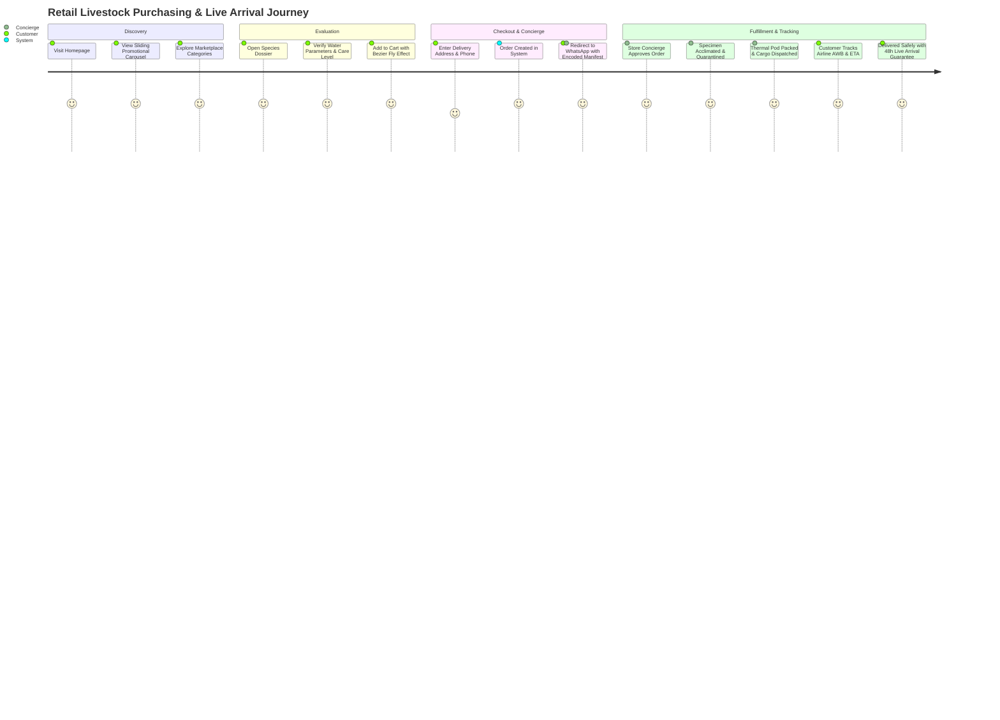

# PRODUCT REQUIREMENTS DOCUMENT (PRD)

**Project Title:** Marine Creatures — Luxury Marine Life E-Commerce & Architectural Aquascaping Platform  
**Document Reference:** `MC-PRD-2026-V2`  
**Document Author:** Chief Technology Officer (CTO) & Lead System Architect  
**Client / Brand Signatory:** Suraj Shasmal (Founder & Managing Director, Marine Creatures)  
**Target Release:** Production Release 2.0 (Full Omnichannel & Cloud Sync)  
**Date:** September 2026  
**Status:** Approved for Implementation & Global Market Deployment  

---

## 1. EXECUTIVE SUMMARY & PRODUCT VISION

### 1.1 Product Vision
**Marine Creatures** is envisioned as India's premier luxury architectural aquascaping firm and exotic marine life purveyor. The platform serves a dual mandate:
1. **High-Ticket Bespoke Design:** Establishing unassailable brand authority as the premier design house for living coral reef ecosystems, custom residential acrylic installations (penthouses, villas), and corporate statement biomes.
2. **Precision Livestock & Hardware E-Commerce:** Providing a seamless, friction-free purchasing experience for delicate captive-bred marine fish, quarantined invertebrates, rare corals, and specialized reef hardware with guaranteed live arrival.

### 1.2 Tagline & Brand Philosophy
> *"Bringing ocean at your door step"*

Every digital touchpoint must evoke the tranquility, depth, and precision engineering of a pristine coral reef ecosystem, combining deep oceanic blues, crystal caustics, micro-animations, and high-trust logistical transparent communication.

---

## 2. MARKET OPPORTUNITY & BUSINESS CONTEXT

### 2.1 The Market Landscape
The saltwater aquarium hobby in India and South Asia is shifting from hobbyist basement setups into a multi-crore luxury lifestyle category. High-Net-Worth Individuals (HNWIs), luxury architects, and premium hospitality establishments demand turnkey living art installations. However, the market suffers from:
- **Extreme High Friction & Trust Deficit:** Live marine organisms are delicate; conventional e-commerce checkout without delivery coordination often leads to specimen stress or mortality.
- **Fragmented Informal Commerce:** Over 85% of exotic livestock transactions in India occur through unstructured WhatsApp messages, Facebook groups, and phone calls without catalog tracking or digital tax invoicing.
- **Lack of Architectural Spec Documentation:** High-ticket clients require dimensional footprints, structural weight loadings, power/water provisions, and filtration filtration parameters before committing ₹5,00,000 to ₹50,00,000+ per installation.

### 2.2 Strategic Objectives
1. **Capture High-Ticket Leads:** Generate qualified consultation requests for bespoke aquarium commissions with project values exceeding ₹5,00,000 INR.
2. **Frictionless Omnichannel Checkout:** Bridge catalog browsing directly into the primary communication medium of Indian consumers (WhatsApp) while automating backend order registration and GST billing.
3. **Live Animal Transparency & Trust:** Provide a 5-stage quarantine-to-flight tracking pipeline that guarantees 100% Dead-on-Arrival (DOA) replacement.
4. **Lean Operational Overhead:** Enable the store founder to run full inventory, order approval, media uploads, and customer follow-up directly from a smartphone with zero technical friction.

---

## 3. USER PERSONAS & STAKEHOLDERS

| Persona Profile | Demographics & Mindset | Core Motivations & Pain Points | Primary User Journey |
| :--- | :--- | :--- | :--- |
| **P-1: The Connoisseur Reef Hobbyist** | • Age: 25–45<br>• Tech-savvy, mobile-first<br>• Owns established reef tank | **Pain:** Fear of receiving sick or misidentified fish; lack of exact water parameters.<br>**Goal:** Secure rare pairs (e.g. Picasso Clownfish), check reef-safety, inspect care levels. | 1. Browses `/marketplace`<br>2. Inspects Species Care Guide<br>3. Adds to Cart with Fly-to-Cart animation<br>4. Checks out on WhatsApp<br>5. Tracks live flight progress |
| **P-2: The HNWI & Luxury Architect** | • Age: 35–60<br>• Commissioning architect, penthouse owner<br>• High purchasing power | **Pain:** Generic aquariums look cheap; fears water leaks or high maintenance.<br>**Goal:** Commission a dramatic, bespoke living installation that elevates property value. | 1. Explores `/our-worlds`<br>2. Reads `/materials` & `/installation`<br>3. Uses Design Estimator<br>4. Submits consultation request<br>5. Schedules on-site engineering survey |
| **P-3: Hospitality / Corporate General Manager** | • Luxury hotel, fine-dining, tech office<br>• Focus on turnkey reliability | **Pain:** Needs guaranteed uptime and immaculate tank presentation with zero staff effort.<br>**Goal:** Turnkey corporate lease or design-and-maintenance contract. | 1. Navigates `/services`<br>2. Reviews corporate maintenance SLAs<br>3. Requests immediate commercial callback |
| **P-4: Managing Owner / Store Concierge (Suraj Shasmal)** | • Founder, Marine Creatures<br>• Managing logistics, quarantine, sales | **Pain:** Manual catalog updates are slow; tracking customer payments and AWB numbers on paper is error-prone.<br>**Goal:** 1-tap stock counter, quick invoice generator, instant WhatsApp follow-up. | 1. Authenticates at `/admin`<br>2. Adjusts stock counts with `+` / `–`<br>3. Approves orders and generates GST invoice<br>4. Dispatches AWB tracking link |

---

## 4. END-TO-END USER JOURNEYS



---

## 5. DETAILED FUNCTIONAL REQUIREMENTS (MODULE-BY-MODULE)

### MODULE 1: LUXURY STOREFRONT & ARCHITECTURAL EXPERIENCE
- **FR-1.1 (Hero Viewport & Particle Caustics):**
  - System must render a full-bleed luxury viewport with ambient water refraction effects, particle animations, and direct CTAs to `/marketplace` and `/aquarium-design`.
  - Must respect `prefers-reduced-motion` accessibility standards.
- **FR-1.2 (Dynamic Sliding Announcement Carousel):**
  - Displays high-priority marketing campaigns, rare specimen drops, and seasonal promotional banners.
  - Automatically advances every 5000ms with manual swipe and indicator dot overrides.
  - Each slide must support a badge, title, subtitle, primary CTA button, optional secondary CTA button, and responsive background imagery.
- **FR-1.3 (Architectural Showcase - `/our-worlds`):**
  - Interactive grid displaying completed architectural aquarium projects across Residential Penthouses, Luxury Villas, and Corporate HQs.
  - Must provide dimensional specs (Length, Width, Height, Volume in Litres), filtration methodology, and livestock biotope classification.
- **FR-1.4 (Materials & Engineering Integrity - `/materials`):**
  - Detailed breakdown of museum-grade cast acrylic (clarity, UV stability, seamless bonding) versus low-iron tempered glass.
  - Engineering load tables and seismic foundation specs.
- **FR-1.5 (Turnkey Services & Maintenance - `/services`, `/installation`, `/renovation`):**
  - Showcase for custom design, professional quarantine services, monthly maintenance contracts, and commercial emergency callouts.

---

### MODULE 2: E-COMMERCE MARKETPLACE & SPECIES CATALOG (`/marketplace`)
- **FR-2.1 (Five Core Taxonomy Segments):**
  - Inventory must be partitionable into five discrete categories:
    1. `marine-life` (Exotic Fish, Corals, Invertebrates)
    2. `lighting-tech` (Reef-spectrum LED modules, programmable timers)
    3. `rock-sand` (Cured live rock, bio-active aragonite sand)
    4. `salt-chemistry` (Synthetic sea salts, trace elements, buffer tests)
    5. `hardware` (Protein skimmers, DC wavemakers, titanium heaters)
- **FR-2.2 (Instant Substring Search & Filter Engine):**
  - Real-time client-side substring matching across `name`, `scientificName`, `description`, and `badge` without page reload.
  - Category pill filter with instant active count badges.
- **FR-2.3 (Stock Indicators & Safeguards):**
  - Real-time stock status display:
    - `In Stock` (stockCount > 3)
    - `Low Stock (Only X Left)` (0 < stockCount <= 3)
    - `Out of Stock` (stockCount === 0)
  - When `stockCount === 0` or `inStock === false`, the "Add to Cart" button must be disabled, replaced with an "Out of Stock" indicator.
- **FR-2.4 (Item Type Differentiation):**
  - Items must carry an explicit `itemType` field: `'live'` or `'dry'`.
  - Live items must display specialized shipping information (Thermal Pod packaging and Live Arrival Guarantee), whereas dry items display standard expedited courier delivery.

---

### MODULE 3: SPECIES CARE DOSSIER & BIOME PARAMETERS
- **FR-3.1 (Biological Specifications Matrix):**
  - Detailed product views must present scientific classification:
    - Scientific Binomial Nomenclature (e.g. *Amphiprion ocellaris*)
    - Natural Biome & Geographic Origin
    - Temperament (Peaceful, Semi-Aggressive, Aggressive)
    - Reef Compatibility (Reef Safe, With Caution, Not Reef Safe)
    - Minimum Recommended Aquarium Volume
    - Dietary Requirements (Carnivore, Herbivore, Omnivore)
- **FR-3.2 (Visual Water Parameter Gauges):**
  - Interactive parameter meters displaying:
    - Temperature Range (e.g. `24°C - 26°C`)
    - Salinity / Specific Gravity (e.g. `1.023 - 1.025 SG`)
    - pH Level (e.g. `8.1 - 8.4`)
    - Care Level Rating (Beginner, Moderate, Expert Only)
- **FR-3.3 (Video Specimen Preview):**
  - Support for embedded 4K specimen behavior videos allowing hobbyists to inspect fin condition, swimming posture, and feeding vigor before purchase.

---

### MODULE 4: CART DRAWER, FLY-TO-CART & WHATSAPP CHECKOUT
- **FR-4.1 (Kinetic Fly-to-Cart Effect):**
  - When a user clicks "Add to Cart" on any product card, an animated thumbnail must detach and fly along a smooth Bezier trajectory directly into the floating cart icon in the top header.
- **FR-4.2 (Cart Drawer & Line Item Control):**
  - Slide-out drawer accessible from any page.
  - Ability to increment/decrement quantities, delete items, and view real-time subtotal calculations in Indian Rupees (₹).
  - Empty state with direct shortcut back to `/marketplace`.
- **FR-4.3 (Order Information Modal):**
  - Before checkout, the customer enters:
    - Full Name (Required)
    - Phone Number (Required, 10-digit Indian standard)
    - Delivery Street Address, City, and Pincode (Required)
    - Special Handling Notes (Optional)
- **FR-4.4 (Omnichannel WhatsApp Dispatch & Cloud Registration):**
  - Submitting checkout performs two simultaneous operations:
    1. Registers an internal order via `POST /api/orders` generating a unique ID (`MC-XXXX`).
    2. Formats a pre-encoded URL and redirects the customer to WhatsApp (`https://wa.me/919330436603?text=...`) containing:
       - Order ID
       - Itemized list with quantities and unit prices
       - Total order value
       - Delivery address and phone number
       - Request for flight cargo schedule verification

---

### MODULE 5: 5-STAGE QUARANTINE & AIR CARGO TRACKING
- **FR-5.1 (Live Tracking Lookup Interface):**
  - Accessible via floating tracker button on `/marketplace` and `/invoice/[id]`.
  - Customers search by 10-digit phone number or Order ID (`MC-XXXX`).
- **FR-5.2 (5-Stage Visual Progress Timeline):**
  - Step 1: **Order Confirmed** — Order verified by Marine Creatures concierge.
  - Step 2: **Quarantine Check** — Specimen inspected in closed-loop quarantine; active feeding verified.
  - Step 3: **Thermal Pod Packed** — Sealed in oxygenated double-layer pouch inside insulated climate pod.
  - Step 4: **Air Cargo Dispatched** — Handed over to priority airline cargo (IndiGo / Air India CarGo) with active Airway Bill (AWB).
  - Step 5: **Delivered Safely** — Delivered to customer doorstep; 48-hour Live Arrival Guarantee active.
- **FR-5.3 (Airway Bill (AWB) Tracking Integration):**
  - Display of courier/carrier name (e.g. "IndiGo CarGo Priority Express"), flight AWB number, and estimated arrival time.

---

### MODULE 6: OFFICIAL GST TAX INVOICE GENERATOR & SECURITY GATE
- **FR-6.1 (Official Tax Invoice Structure - `/invoice/[id]`):**
  - Compliant with Indian Goods and Services Tax (GST) invoicing standards:
    - Marine Creatures registered business header & Kolkata address
    - System Invoice Number (`INV-MC-XXXX`)
    - HSN Code `01062000` for live aquatic specimens
    - Itemized breakdown: Base Price, Quantity, Taxable Value, CGST (9%), SGST (9%) or IGST (18%)
    - Total Gross Amount in Words & Numerals
- **FR-6.2 (Digital Signatory & Stamp):**
  - Embeds authorized digital signature (`/signature.png`) and official seal of Suraj Shasmal.
- **FR-6.3 (Export & Print Utility):**
  - One-click print / save to PDF formatted for standard A4 paper (`@media print` clean stylesheet stripping headers/navigation).
  - One-click WhatsApp share button sending formatted invoice manifest directly to the customer's phone number.
- **FR-6.4 (Privacy Security Gate - Phone Verification):**
  - To prevent web scraping and public harvesting of customer addresses and invoice records, visiting `/invoice/[id]` prompts non-admin users to input the customer's 10-digit phone number.
  - Invoice details remain blurred and inaccessible until phone matches the order record. Authenticated administrators bypass this gate automatically.

---

### MODULE 7: ARCHITECTURAL CONSULTATION & ESTIMATOR PIPELINE
- **FR-7.1 (Interactive Estimate Calculator):**
  - Multi-step configurator allowing clients to choose:
    - Tank Form Factor (Built-in Wall, 360° Peninsula, Cylinder, Double-Sided Room Divider)
    - Approximate Dimensions (Volume in Gallons / Litres)
    - Biome Type (SPS Ultra Coral Reef, Predatory Saltwater, FOWLR)
    - Cabinetry Finish (Matte Obsidian, Italian Marble Wrap, Fluted Oak)
- **FR-7.2 (Direct Lead Dispatch):**
  - Form submission registers lead in `inquiries` database and triggers instant notification to store founder.

---

### MODULE 8: MOBILE-FIRST ADMIN CONTROL OS (`/admin`)
- **FR-8.1 (Passcode Shield & Rate Limiting):**
  - Route accessible only via master secret key.
  - Brute-force protection: IP throttled after 5 failed attempts.
- **FR-8.2 (Tab 1: Overview & Metrics):**
  - Summary cards: Total Products, Active Livestock, Total Orders, Pending Quarantine, Inquiries, Gross Sales Revenue.
- **FR-8.3 (Tab 2: Products Management):**
  - Live stock counter buttons (`+` and `-`) for thumb-friendly stock adjustments.
  - Instant Active/Paused toggle.
  - Complete Product CRUD modal: Title, scientific name, category, pricing, care parameters, HSN codes, and image/video URLs.
  - Direct Media Upload: Supports up to 25MB specimen videos and photos with Cloudinary CDN / MongoDB fallback.
- **FR-8.4 (Tab 3: Orders & Dispatch Management):**
  - Filter orders by status (`All`, `Pending Approval`, `Quarantine`, `Dispatched`, `Delivered`).
  - One-click "Approve & Generate Invoice" action.
  - 1-tap Step Advance: Advance orders through quarantine, packing, dispatch (with AWB input), and delivery.
  - One-tap WhatsApp follow-up button with pre-written customer dispatch status text.
  - One-click link to view or print official tax invoice.
- **FR-8.5 (Tab 4: Sliding Banners Management):**
  - Full CRUD for homepage announcement slides.
  - Priority slider (1–10) controlling slide order.
  - Active toggle to show or hide slides instantly.
- **FR-8.6 (Tab 5: Inquiries & Leads CRM):**
  - Lead cards with client name, phone number, desired space type, tank dimensions, and notes.
  - One-tap WhatsApp reply button pre-filling customer's name and consultation topic.
  - Status transitions: `new` -> `contacted` -> `scheduled` -> `completed` -> `archived`.
- **FR-8.7 (Tab 6: System & Disaster Recovery):**
  - MongoDB Atlas health monitor: Cluster status, ping latency, and collection record counts.
  - Database re-seed utility (`POST /api/seed`).
  - Capture Cloud Snapshot: One-click backup to MongoDB snapshots collection with SHA-256 checksums.
  - Export Offline JSON: One-click local backup download.
  - Import JSON: Atomic rollback/restore with schema verification.

---

## 6. NON-FUNCTIONAL REQUIREMENTS (NFR)

### 6.1 Performance & Latency
- **First Contentful Paint (FCP):** < 0.8 seconds on 4G mobile networks.
- **Largest Contentful Paint (LCP):** < 1.8 seconds.
- **Cumulative Layout Shift (CLS):** < 0.05.
- **Database Query Latency:** < 50ms average on indexed MongoDB Atlas queries.

### 6.2 Mobile Ergonomics & Responsive Design
- Fully responsive across 320px (mobile compact) up to 2560px+ (4K ultra-wide monitors).
- Interactive touch targets must adhere to WCAG 2.1 AA standards (minimum 44x44px).
- Bottom navigation bar must incorporate iOS safe-area insets (`env(safe-area-inset-bottom)`).

### 6.3 Security & Regulatory Compliance
- **Passcode Protection:** Cryptographically signed session tokens; secret passcodes never exposed in client bundles.
- **Data Privacy:** Customer phone numbers and physical delivery addresses protected by verification gate on public invoice URLs.
- **Wildlife Compliance:** Live specimens sold must strictly comply with the **Wildlife Protection Act of India (1972)** and CITES appendices (non-native captive-bred marine ornamental species only; zero native protected reef species).

---

## 7. RELEASE ROADMAP & PHASING

```
┌────────────────────────────────────────────────────────────────────────┐
│ Phase 1: Foundation (COMPLETED)                                        │
│ • Next.js 16 App Router + Tailwind v4 Luxury Dark Design System        │
│ • Full Catalog of 20+ exotic marine species and specialized reef gear  │
│ • Offline-first LocalStorage state engine + WhatsApp checkout bridge   │
├────────────────────────────────────────────────────────────────────────┤
│ Phase 2: Enterprise Cloud & Logistics (CURRENT PRODUCTION RELEASE)     │
│ • MongoDB Atlas cloud database synchronization with offline fallback   │
│ • 5-Stage Specimen Quarantine & Airline Air Cargo live tracking        │
│ • Official GST Tax Invoice generator with phone verification gate      │
│ • Stealth Mobile Admin OS with live stock counters & media upload      │
│ • Automated cloud snapshots and disaster recovery engine               │
├────────────────────────────────────────────────────────────────────────┤
│ Phase 3: Future Expansion (Q1–Q2 2027)                                 │
│ • Integrated Razorpay / Stripe gateway for dry goods and hardware      │
│ • Direct IndiGo / Air India CarGo API webhook tracking updates         │
│ • WebGL 3D Interactive Aquarium Room Customizer (Three.js / React Fiber│
│ • Customer Loyalty & Coral Frag Subscription Portal                    │
└────────────────────────────────────────────────────────────────────────┘
```

---

## 8. KEY PERFORMANCE INDICATORS (KPIS) & SUCCESS METRICS

| Metric Category | Target KPI | Measurement Tool / Method |
| :--- | :--- | :--- |
| **Consultation Lead Velocity** | 15+ qualified architectural aquarium inquiries / month | Inquiries CRM Tab & WhatsApp Business Logs |
| **Retail Checkout Conversion** | 3.5%+ visitor-to-WhatsApp order conversion rate | Google Analytics 4 / Catalog Event Tracing |
| **Mobile Performance** | 90+ Lighthouse Mobile Performance Score | Vercel Analytics & Google PageSpeed Insights |
| **Live Arrival Survival Rate** | 99.5%+ successful live livestock arrivals | Order History DOA audit logs |
| **Admin Task Efficiency** | < 15 seconds to update stock count or publish a new drop | Admin interaction latency testing |
| **Platform Uptime** | 99.9% availability across edge routes | Vercel Edge Heartbeat & MongoDB Atlas Monitoring |
