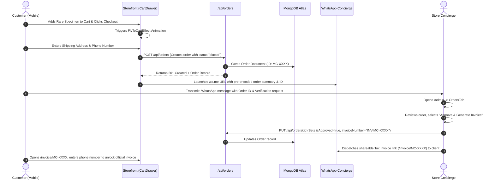

# SYSTEM ARCHITECTURE & TECHNICAL DESIGN DOCUMENT (TDD)

**Project:** Marine Creatures — Luxury Marine Life E-Commerce & Architectural Aquascaping Platform  
**Document Reference:** `MC-ENG-ARCH-2026-V2`  
**Role:** Chief Technology Officer (CTO) Architectural Blueprint  
**Target Environment:** Next.js 16 (React 19) • MongoDB Atlas • Tailwind CSS v4 • Vercel Edge  
**Last Revised:** September 2026  
**Status:** Approved Architectural Specification  

---

## 1. EXECUTIVE TECHNICAL SUMMARY & PRINCIPLES

**Marine Creatures** operates at the intersection of high-ticket bespoke architectural installations and high-velocity exotic live marine specimen retail. The digital platform must deliver an ultra-luxury, fluid brand presence (rivaling European and Japanese bespoke design houses) while maintaining extreme resilience, high performance on mobile devices (where >90% of prospective clients browse), and zero checkout friction for the Indian market via WhatsApp Concierge integration.

### Core Architectural Principles
1. **Zero-Latency Perceived Performance (Offline-First Hybrid Cache):** The client application renders immediately from local storage snapshots, hydrating asynchronously against MongoDB Atlas. If cloud connectivity degrades or is unavailable, the user and store manager experience zero downtime.
2. **Strict Client-Admin Isolation & Stealth Security:** The administrative control center (`/admin`) is completely decoupled and invisible in the customer bundle. Session authentication uses cryptographically signed HMAC-SHA256 tokens in `httpOnly` secure cookies with timing-attack-resistant verification (`crypto.timingSafeEqual`) and sliding-window rate limiting.
3. **Omnichannel WhatsApp Transaction Bridge:** Rather than forcing traditional payment gateways for delicate live animals (which require live flight cargo schedules, acclimation consultation, and customized delivery logistics), checkout routes directly into structured WhatsApp business payloads while simultaneously recording internal order states and generating official GST Tax Invoices.
4. **Dual-Tier Asset Delivery Engine:** Specimen photography and 4K macro video assets stream through an intelligent fallback pipeline: Cloudinary CDN if API credentials are active, falling back seamlessly to an internal binary streaming engine (`/api/media/[id]`) backed by MongoDB GridFS/Binary BSON with 1-year immutable caching (`max-age=31536000`).

---

## 2. HIGH-LEVEL SYSTEM TOPOLOGY

```mermaid
graph TD
    subgraph Client Tier [Edge Browsers & Mobile Clients]
        Visitor[Public Visitors 90%+ Mobile]
        ClientAdmin[Store Manager / Admin]
    end

    subgraph Edge CDN & Routing Layer [Vercel Global Edge Network]
        CloudflareEdge[Edge CDN / SSL Termination]
        EdgeProxy[Next.js Proxy & Sliding-Window Rate Limiter]
    end

    subgraph Application Tier [Next.js 16 App Router Runtime]
        StorefrontPages[Server & Client Pages: /, /marketplace, /marine-life, /our-worlds, /services]
        InvoicePortal[Phone-Gated Tax Invoice Engine: /invoice/:id]
        AdminApp[Stealth Admin Control OS: /admin]
        
        subgraph State Engines [Client-Side Contexts]
            CatalogCtx[CatalogContext: Products, Banners, Leads]
            OrderCtx[OrderContext: Orders, Live Tracking, Invoices]
            CartCtx[CartContext: Local Cart, Fly-to-Cart Animation]
            WishlistCtx[WishlistContext: Customer Saved Items]
            ThemeCtx[ThemeContext: Ocean Luminescence State]
        end

        subgraph Server Route Handlers [/api]
            ApiProducts[/api/products - Catalog CRUD]
            ApiOrders[/api/orders - Multi-Stage Lifecycle & Tracking]
            ApiInquiries[/api/inquiries - Architectural Leads]
            ApiBanners[/api/banners - Hero Slide Management]
            ApiMedia[/api/media/:id - Binary Asset Streaming Engine]
            ApiAdminLogin[/api/admin/login - HMAC-SHA256 Auth]
            ApiBackup[/api/admin/backup - Disaster Recovery Snapshots]
            ApiSeed[/api/seed - MongoDB Re-seeding & Migration]
            ApiHealth[/api/health - DB Latency & Heartbeat]
        end
    end

    subgraph Data & Storage Tier [Hybrid Storage Layer]
        LocalCache[(Browser LocalStorage & SessionStorage)]
        MongoAtlas[(MongoDB Atlas Multi-Region Cluster0)]
        CloudinaryCDN[(Cloudinary Media CDN Optional)]
    end

    subgraph External Omnichannel Services
        WhatsApp[WhatsApp Business API Concierge +91 93304 36603]
        AirCargo[Domestic Airline Air Cargo Tracking]
        GoogleMapsApi[Google Maps Geolocation]
    end

    %% Connections
    Visitor --> CloudflareEdge
    ClientAdmin --> CloudflareEdge
    CloudflareEdge --> EdgeProxy
    EdgeProxy --> StorefrontPages
    EdgeProxy --> InvoicePortal
    EdgeProxy --> AdminApp
    EdgeProxy --> Server Route Handlers

    StorefrontPages --> State Engines
    AdminApp --> State Engines
    InvoicePortal --> OrderCtx

    State Engines <-->|Zero-Latency Read/Write| LocalCache
    State Engines <-->|Background Sync| Server Route Handlers

    Server Route Handlers <-->|Mongoose 9.9 Connection Pooling| MongoAtlas
    ApiAdminLogin -->|HMAC Cookie| ClientAdmin
    ApiMedia -->|Binary Stream / Lean Query| MongoAtlas
    ApiAdminUpload -->|Upload Pipe| CloudinaryCDN
    ApiAdminUpload -->|Fallback Binary Blob| MongoAtlas

    StorefrontPages -->|Pre-filled WhatsApp Protocol| WhatsApp
    InvoicePortal -->|Shareable Tax Invoice| WhatsApp
    OrderCtx -->|AWB Tracking| AirCargo
```

---

## 3. COMPONENT DECOMPOSITION & SUBSYSTEMS

### 3.1 Presentation & Client Runtime Layer
- **Framework:** Next.js 16.3.1 (React 19.2.8) utilizing the App Router architecture.
- **Styling Architecture:** Tailwind CSS v4 featuring an obsidian-marine custom color palette:
  - Deep Abyssal Navy (`#030B17`)
  - Oceanic Trench (`#0A192F`)
  - Bioluminescent Cyan (`#00B8D9` / `#00F0FF`)
  - High-Gloss Seafoam (`#10B981`)
  - Glassmorphic Acrylic Panels (`backdrop-blur-md bg-white/[0.03] border-white/[0.08]`)
- **Kinetic Animation Pipeline:**
  - **Lenis 1.3.26:** Smooth inertial scrolling delivering a frictionless desktop experience.
  - **GSAP 3.15 + `@gsap/react`:** High-performance hardware-accelerated water surface caustics, wave displacement, and parallax effects.
  - **Framer Motion 13.1:** Dynamic micro-interactions including the **Fly-to-Cart Bezier Trajectory** (`FlyToCartEffect.tsx`), spring-physics drawers, and species water parameter gauge animations.

### 3.2 State Management & Hybrid Offline-Cloud Sync Engine
The client state architecture employs a multi-tiered provider model designed for instant hydration:
1. **Initial Mount:** Components mount and read immediately from `localStorage` (`mc_products_v1`, `mc_banners_v1`, `mc_customer_orders_v1`). This guarantees a First Contentful Paint (FCP) of under 0.8s on 4G networks without waiting for database handshakes.
2. **Asynchronous Cloud Revalidation:** `CatalogContext` and `OrderContext` trigger background `fetch()` calls to `/api/products`, `/api/banners`, and `/api/orders`. Incoming server state is normalized, diffed, and written back to both React state and `localStorage`.
3. **Optimistic Updates:** When an administrator adjusts stock counters (`+` / `-`) or pauses an item, the local state mutates in 0ms, and an asynchronous `PUT` is dispatched to the API. If network failure occurs, the UI maintains local state and marks cloud synchronization as pending.

### 3.3 Server & API Gateway Layer (`app/api`)
Built on Next.js Edge and Node.js Route Handlers:
- **`proxy.ts` (Edge Middleware):** Intercepts requests targeting `/api/admin/login` and `/admin/*`. Implements an in-memory sliding-window rate limiter allowing a maximum of 5 failed login attempts per 60-second window per IP. Exceeding requests receive an HTTP 429 response with a `Retry-After` header.
- **`lib/auth.ts`:**
  - Validates passcodes with constant-time buffer comparisons (`crypto.timingSafeEqual`) to eliminate timing-attack vulnerability vectors.
  - Signs session tokens using HMAC-SHA256 (`mc_admin_<timestamp>_<nonce>.<signature>`) stored in secure `httpOnly` cookies with an 8-hour Time-to-Live (TTL).
- **`app/api/media/[id]/route.ts`:** Directly streams binary image and video payloads from MongoDB Atlas with `Content-Type`, `Content-Length`, `Accept-Ranges: bytes`, and immutable cache headers (`Cache-Control: public, max-age=31536000, immutable`).

---

## 4. DATA MODEL & SCHEMA SPECIFICATIONS (MONGOOSE / TYPESCRIPT)

The system is backed by MongoDB Atlas using strongly-typed Mongoose 9.9 schemas.

### 4.1 Product Schema (`models/Product.ts`)
```typescript
export interface IProductDocument extends Document {
  id: string;                     // Unique human-readable slug e.g. "picasso-clownfish-pair"
  name: string;                   // Display title
  scientificName?: string;        // Binomial Latin nomenclature (e.g. Amphiprion percula)
  brand?: string;                 // Brand or "Marine Creatures Direct"
  itemType?: 'live' | 'dry';      // Distinguishes livestock vs dry hardware/chemicals
  category: string;               // 'marine-life' | 'lighting-tech' | 'rock-sand' | 'salt-chemistry' | 'hardware'
  categoryLabel: string;          // Human-readable category label
  price: number;                  // Selling price in INR (₹)
  originalPrice?: number;         // MRP / Strikethrough price
  rating: number;                 // 1.0 - 5.0 score
  reviewsCount: number;           // Total verified reviews
  badge?: string;                 // Promotional tag: "Bonded Pair", "Rare Drop", "WYSIWYG"
  inStock: boolean;               // Visibility & purchasing toggle
  stockCount: number;             // Available units
  images: string[];               // Primary image URLs (Cloudinary or /api/media/...)
  videos?: string[];              // Specimen behavior video URLs
  media?: Array<{
    id: string;
    type: 'image' | 'video';
    url: string;
    thumbnail?: string;
    title?: string;
  }>;
  shortDesc: string;              // 1-sentence teaser for cards
  description: string;            // Extended care & biological details
  deliveryInfo?: {
    estimatedDays: string;        // e.g. "Within 24-48 Hours"
    shippingMethod: string;       // e.g. "Direct Air Cargo / Insulated Thermal Pod"
    guaranteeText: string;        // e.g. "100% Live Arrival Guaranteed"
  };
  careGuide?: {
    temperature: string;          // e.g. "24°C - 26°C"
    salinity: string;             // e.g. "1.023 - 1.025 SG"
    ph: string;                   // e.g. "8.1 - 8.4"
    diet?: string;                // Carnivore / Herbivore / Omnivore
    temperament?: string;         // Peaceful / Semi-Aggressive
    minimumTankSize?: string;     // e.g. "50 Gallons (200 Litres)"
    reefSafe?: boolean;           // True / False
    careLevel?: string;           // Beginner / Intermediate / Expert Only
  };
  hsnCode?: string;               // GST Harmonized System of Nomenclature (Default: 01062000)
  createdAt: Date;
  updatedAt: Date;
}
```
**Database Indexes:**
- `{ id: 1 }` (Unique, Sparse)
- `{ category: 1, inStock: 1 }` (Compound index for marketplace filtering)
- `{ name: 'text', scientificName: 'text', description: 'text' }` (Text search index)

---

### 4.2 Order Schema (`models/Order.ts`)
```typescript
export interface IOrderItem {
  id: string;
  name: string;
  price: number;
  quantity: number;
  image?: string;
  category?: string;
}

export interface IOrderHistory {
  step: 'placed' | 'quarantine' | 'packed' | 'dispatched' | 'delivered';
  timestamp: string;
  note: string;
}

export interface IOrderDocument extends Document {
  id: string;                     // e.g. "MC-8921"
  customerName: string;
  phone: string;                  // Primary lookup key for customer tracking
  address: string;
  city: string;
  pincode: string;
  orderNotes?: string;
  items: IOrderItem[];
  subtotal: number;
  totalAmount: number;
  currentStep: 'placed' | 'quarantine' | 'packed' | 'dispatched' | 'delivered';
  awbNumber?: string;             // Airline / Courier Airway Bill Number
  courierName: string;            // e.g. "IndiGo CarGo Priority Express"
  estimatedDelivery: string;
  history: IOrderHistory[];       // Audit log of state transitions
  isApproved: boolean;            // Administrative validation flag
  approvedAt?: string;
  invoiceNumber?: string;         // e.g. "INV-MC-8921"
  createdAt: string;
  updatedAt: Date;
}
```
**Database Indexes:**
- `{ id: 1 }` (Unique)
- `{ phone: 1 }` (Lookup index for customer live tracking)
- `{ currentStep: 1, isApproved: 1 }` (Operational workflow queries)

---

### 4.3 Architectural Inquiry Schema (`models/Inquiry.ts`)
```typescript
export interface IInquiryDocument extends Document {
  id: string;                     // e.g. "INQ-1725792000000"
  type: 'callback' | 'service_booking' | 'custom_quote' | 'whatsapp_order' | 'estimator_lead';
  name: string;
  phone: string;
  email?: string;
  serviceType?: string;           // e.g. "Bespoke Living Reef Installation"
  spaceType?: string;             // Penthouse / Luxury Villa / Corporate HQ / Hotel Lobby
  tankSize?: string;              // e.g. "8ft x 3ft x 3ft (2000 Litres)"
  location?: string;              // City / Neighborhood
  notes?: string;                 // Architectural constraints, MEP provisions
  preferredDate?: string;
  items?: string;
  status: 'new' | 'contacted' | 'scheduled' | 'completed' | 'archived';
  createdAt: Date;
  updatedAt: Date;
}
```

---

### 4.4 Media Storage Schema (`models/Media.ts`)
```typescript
export interface IMedia extends Document {
  id: string;                     // e.g. "media-1725899201-k9f2a"
  filename: string;               // e.g. "emperor-angel-macro.mp4"
  contentType: string;            // "image/jpeg", "image/webp", "video/mp4"
  size: number;                   // In bytes (Up to 25MB max)
  data: Buffer;                   // Binary BSON storage
  type: 'image' | 'video';
  createdAt: Date;
}
```

---

### 4.5 System Snapshot & Disaster Recovery Schema (`models/Snapshot.ts`)
```typescript
export interface ISnapshotDocument extends Document {
  id: string;                     // e.g. "snap-2026-09-08-0845"
  label: string;                  // User-defined or auto tag
  source: 'automated_cron' | 'admin_manual' | 'system_seed';
  counts: {
    products: number;
    orders: number;
    banners: number;
    inquiries: number;
  };
  data: {
    products: any[];
    orders: any[];
    banners: any[];
    inquiries: any[];
    settings?: Record<string, any>;
  };
  checksum: string;               // SHA-256 integrity hash
  sizeBytes: number;
  createdAt: Date;
}
```

---

## 5. CORE SYSTEM FLOWS & SEQUENCE DIAGRAMS

### 5.1 Omnichannel Order Placement & GST Invoice Generation


---

### 5.2 5-Stage Specimen Quarantine & Air Cargo Tracking Sequence
```mermaid
sequenceDiagram
    autonumber
    actor Admin as Store Manager (/admin)
    participant API as /api/orders/:id
    participant DB as MongoDB Atlas
    actor Customer as Customer
    participant Tracker as Order Tracker (/marketplace)

    Admin->>API: Advance Step to "quarantine" (Adds note: "Active feeding verified; salinity balanced")
    API->>DB: Appends to order.history array
    Admin->>API: Advance Step to "packed" (Adds note: "Oxygenated thermal pod sealed")
    API->>DB: Appends to order.history array
    Admin->>API: Advance Step to "dispatched" (Input: AWB="6E-442-CCU-BLR", Carrier="IndiGo CarGo")
    API->>DB: Updates currentStep, courierName, awbNumber
    
    Customer->>Tracker: Opens Live Tracking Modal & enters phone / Order ID
    Tracker->>API: GET /api/orders?phone=XXXXXXXXXX
    API->>DB: Queries Order by phone index
    API-->>Tracker: Returns populated 5-step timeline with timestamps & airline AWB
    Tracker-->>Customer: Renders interactive progress bar with arrival ETA & guarantee status
```

---

## 6. SECURITY POSTURE & DEFENSE-IN-DEPTH

| Security Dimension | Technical Countermeasure & Implementation |
| :--- | :--- |
| **Admin Route Obfuscation** | The `/admin` path is completely stripped from all public navigation components, sitemaps (`sitemap.ts`), and robots directives (`robots.ts`). Customer bundles contain zero href paths referencing administrative control endpoints. |
| **Brute-Force Mitigation** | `/api/admin/login` is governed by an in-memory sliding-window IP rate limiter (`proxy.ts`). IPs exceeding 5 attempts within 60 seconds are blocked with HTTP 429 and mandatory cool-off headers. |
| **Timing Attack Resistance** | All passcode evaluations in `lib/auth.ts` use `crypto.timingSafeEqual()`. String comparison execution duration is strictly uniform regardless of character matching prefixes. |
| **Session Integrity** | Sessions utilize cryptographically signed tokens (`HMAC-SHA256`) containing timestamps and high-entropy nonces (`crypto.randomBytes(16)`), stored in `httpOnly`, `SameSite=Lax`, `Secure` cookies with an 8-hour expiration. |
| **Customer PII Gate (Invoices)** | The `/invoice/[id]` route prevents public harvesting and URL ID enumeration. Non-admin visitors must verify the customer's 10-digit telephone number before unlocking customer names, residential addresses, and total transaction figures. |
| **XSS & Content Security** | React 19 JSX auto-escapes dynamic rendering. Media streaming routes enforce strict MIME-type headers (`image/jpeg`, `image/webp`, `video/mp4`) with `nosniff` flags to prevent script execution inside media uploads. |

---

## 7. DISASTER RECOVERY & DATA PRESERVATION

The platform features a three-tier disaster recovery architecture:
1. **Automated Mongoose Cloud Snapshots:** Administrators can trigger atomic snapshot captures (`/api/admin/backup`) storing complete database collections (products, orders, banners, inquiries, system settings) into the `snapshots` collection with SHA-256 integrity checksums.
2. **One-Click Human-Readable JSON Export:** Store managers can download an offline timestamped JSON bundle directly to their local desktop or smartphone.
3. **Atomic Rollback & Restore Engine:** If bad data or accidental deletion occurs, administrators can paste a valid JSON backup string into the System Tab. The engine validates the payload schema, clears existing collections, and re-seeds the operational state in a single transaction.

---

## 8. INFRASTRUCTURE, EDGE CDN & DEVOPS SPECIFICATION

- **Hosting & Edge Compute:** Vercel Global Edge Network with continuous deployment from GitHub master branch.
- **Node.js Target Version:** Node.js 20.x LTS / Next.js 16.3.1.
- **Database Infrastructure:** MongoDB Atlas Cluster0 (AWS / Mumbai ap-south-1 region for sub-20ms latency to primary Indian customer base).
- **Edge Caching Rules:**
  - Dynamic API routes: `Cache-Control: private, no-cache, no-store, must-revalidate`
  - Static media routes (`/api/media/*`): `Cache-Control: public, max-age=31536000, immutable`
  - Product static renders: Incremental Static Regeneration (ISR) with 60-second revalidation windows.
